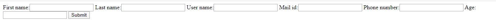

## Form
Django provides a range of tools and libraries to help you build forms to accept input from site visitors, and then process and finally send that information back to the server.
### HTML forms
In HTML, a form is a collection of elements inside `<form>...</form>` that allow a visitor to do things like enter text, select options, manipulate objects or controls, and so on, and then send that information back to the server.

Handling forms is a complex business. Consider below Registration example, where numerous items of data of several different types may need to be prepared for display in a form, rendered as HTML, edited using a convenient interface, returned to the server, validated and cleaned up, and then saved or passed on for further processing.

``` html
    <form class="form" method="post">
    <div class="form-group">
        <label for="firstName">First Name</label>
        <input type="text" id="firstName" name="firstName" placeholder="Enter your First Name">
        <br>
        <label for="lastName">Last Name</label>
        <input type="text" id="lastName" name="lastName" placeholder="Enter your First Name">
        <br>
        <label for="emailId">Email Id</label>
        <input type="text" id="emailId" name="emailId" placeholder="Email">
        <br>
        <label for="password">Password</label>
        <input type="password" id="password" name="password" placeholder="password">
        <br>
        <label for="phoneNo">Phone Number</label>
        <input type="text" id="phoneNo" name="phoneNo" placeholder="Phone Number">
        <br>
        <button class="btn btn-primary" type="submit"> login </button>
    </div>
</form>
 
```
Django’s form functionality can simplify and automate vast portions of this work, and can also do it more securely than most programmers would be able to do in code they wrote themselves.

---
> **_NOTE:_** In the context of a Web application, ‘form’ might refer to that HTML `<form>`, or to the Django Form that produces it, or to the structured data returned when it is submitted, or to the end-to-end working collection of these parts.
---
### The Django Form class
A Form class describes a form and determines how it works and appears.In a similar way that a model class’s fields map to database fields, a form class’s fields map to HTML form `<input>` elements.

## Building a form in Django
By Consider the above Registraion example, which we could use to implement “Registraion” functionality on our website: 
First we need to create **froms.py** file in our app location and import Register model class from models.py

**`models.py`**
```python
from django.db import models

class Register(models.Model):
    firstName = models.CharField(max_length=100)
    lastName = models.CharField(max_length=100)
    emailId = models.MailField(null = True)
    phoneNo = models.CharField(max_length=10)
    age = models.IntegerField(null=True)
```
We need to import Django forms first (from django import forms) and our Register model (from .models import Register). Next, we have class Meta, where we tell Django which model should be used to create this form (model = Register). Finally, we can say which field(s) should end up in our form. In this scenario if we want only few fields then metion them in a list formate.

**`forms.py`**
```python
from django import forms
from .models import Register


class RegisterForm(forms.ModelForm):
    class Meta:
        model = Register
        fields = "__all__"
```
Here’s how the form data could be processed in the view that handles this form:

**`views.py`**
```python
from django.shortcuts import render, redirect, reverse
from django.http import HttpResponse
from .forms import RegisterForm
from .models import Register

def register(request):
    if request.method == "POST":
        form = RegisterForm(request.POST)
        if form.is_valid():
            firstName = request.POST.get('firstName')
            lastName = request.POST.get('lastName')
            emailId = request.POST.get('emailId')
            phoneNo = request.POST.get('phoneNo')
            age = request.POST.get('age')
            model = Register(firstName=firstName, lastName=lastName, emailId=emailId, phoneNo=phoneNo, age=age)
            model.save()
            return HttpResponse("Registration successfull")
    form = RegisterForm()
    return render(request,'register.html',{'form':form})
```
Passing the context of form into register template that looks like this:

**`register.html`**
```html
<form action="" method="post">
    
    {{ form }}
    <input type="submit" value="Submit">
</form>
```
> **_NOTE:_** Don’t forget that a form’s output does not include the surrounding `<form>` tags, or the form’s submit control. You will have to provide these yourself.

All you need to do to get your form into a template is to place the form instance into the template context. So if your form is called form in the context, {{ form }} will render its `<label>` and `<input>` elements appropriately.

This is a very basic form rendering, and as it is, Django will render it like this, with no style, just plain form fields: 


Form is working properly but visuals are disappointing, Django provides some predefined ways to show forms in convenient manner. In templates following will modify the inputs as,

-   {{ form.as_table }} will render them as table cells wrapped in `<tr>` tags
-   {{ form.as_p }} will render them wrapped in `<p>` tags
-   {{ form.as_ul }} will render them wrapped in `<li>` tags
> **_NOTE:_** you’ll have to provide the surrounding `<table>` or `<ul>` elements yourself.
