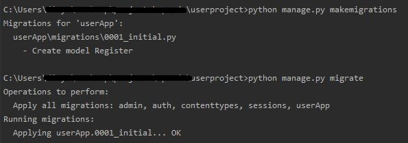

## User Registration
### Model Creation
Model is a blue print for how we gonna store data (Creating the structure of tables).In other words, a model is a class which is used to contain essential fields and methods. Each model class maps to a single table in the database.
Let’s Create a Register model in `models.py` file

**`models.py`**
```python
from django.db import models


class Register(models.Model):
    gender_vals = [('Male', 'Male'), ('FeMale', 'FeMale')]
    firstName = models.CharField(max_length=100)
    lastName = models.CharField(max_length=100)
    emailId = models.EmailField(null=True)
    phoneNo = models.CharField(max_length=10)
    age = models.IntegerField(null=True)
    gender = models.CharField(max_length=10, choices=gender_vals)
    date_of_birth = models.DateField(null=True)
```
Each of our model fields has a related Django field type and field options. The Register model uses four different field types—CharField, DateTimeField, TextField and EmailField.

> **_NOTE:_** Don't forget to mention app name in INSTALLED_APPS list of settings.py file, if you created a new app
### Sync With database
Now that we’ve created the model, it’s time to add it to the database. To do this we need to open Command Promnt and run these two commands: 
-	python manage.py makemigrations 
-	python manage.py migrate
Your terminal output should look something like this:


> **_NOTE:_** If you made any changes in the model you need to follow these two steps every time.

### Form Creation
A Form class describes a form and determines how it works and appears.In a similar way that a model class’s fields map to database fields, a form class’s fields map to HTML form `<input>` elements.

For the above Registraion model, which we could use to implement “Registraion” functionality on our website: 
First we need to create **froms.py** file in our app location and import Register model class from models.py

**`forms.py`**
```python
from django import forms
from .models import Register


class RegisterForm(forms.ModelForm):
    class Meta:
        model = Register
        fields = "__all__"
```
We need to import Django forms first (from django import forms) and our Register model (from .models import Register). Next, we have class Meta, where we tell Django which model should be used to create this form (model = Register). Finally, we can say which field(s) should end up in our form. In this scenario if we want only few fields then metion them in a list formate.

Here’s how the form data could be processed in the view that handles this form:

**`views.py`**
```python
from django.shortcuts import render
from django.http import HttpResponse
from .forms import RegisterForm


def register(request):
    form = RegisterForm()
    return render(request,'register.html',{'form':form})
```
Initially we are using get method, To check how from is working
> **_NOTE:_** Here we are using BootstrapCDN

**`register.html`**
```<!DOCTYPE html>
<html>
<head>
    <title>Registration</title>
	<meta charset="utf-8">
	<meta name="viewport" content="width=device-width, initial-scale=1">
	<link rel="stylesheet" href="https://maxcdn.bootstrapcdn.com/bootstrap/4.4.1/css/bootstrap.min.css">
	<script src="https://maxcdn.bootstrapcdn.com/bootstrap/4.4.1/js/bootstrap.min.js"></script>
</head>
<body>
	<div class="container">
		<div class="row justify-content-center">
			<div class="card">
			<div class="card-header bg-info">Registration Page</div>
			<div class="card-body">
				<form method="POST">
					
					<table>
						{{ form.as_table }}
					</table>
					<div class="card-footer">
					<input class="btn btn-info" type="submit" name="submit" value="Submit">
					</div>
				</form>
			</div>
		</div>
		</div>
	</div>
</body>
</html>
```
> **_NOTE:_** Don’t forget that a form’s output does not include the surrounding `<form>` tags, or the form’s submit control. You will have to provide these yourself.

Here we got the output like this


### Form validation
Till now we haven't used post method from register.htmt, a visitor will hit the `submit` button after filling up the details, that means the form method is changed to "POST".

Now our task is to validate the form and save details, for that we need to change register function in views.py 

**`views.py`**
```python
def register(request):
    if request.method == "POST":
        form = RegisterForm(request.POST)
        print(form.is_valid())
        if form.is_valid():
            form.save()
            return HttpResponse("Registration successfull")
    form = RegisterForm()
    return render(request,'userApp/register.html',{'form':form})
```
> **_NOTE:_** Fill the Data of birth must be in formate of YYYY-MM-DD


> **_NOTE:_** Add the  to every Django template you create that uses POST to submit data. This will reduce the chance of forms being hijacked by malicious users.
